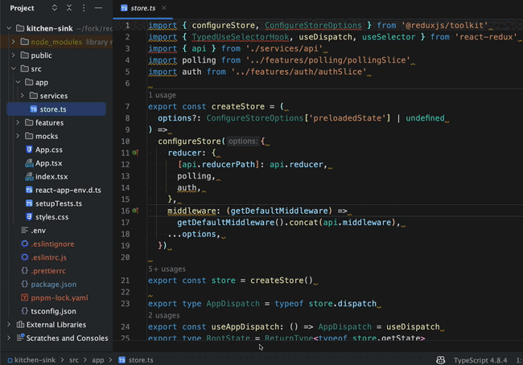

<!-- START doctoc generated TOC please keep comment here to allow auto update -->
<!-- DON'T EDIT THIS SECTION, INSTEAD RE-RUN doctoc TO UPDATE -->

- [eslint-config-ts-prefixer 🌈](#eslint-config-ts-prefixer-)
  - [This config is:](#this-config-is)
- [Installation](#installation)
  - [1. install necessary packages.](#1-install-necessary-packages)
  - [2. Setup config files with `npx eslint-config-ts-prefixer config`.](#2-setup-config-files-with-npx-eslint-config-ts-prefixer-config)
    - [`npx eslint-config-ts-prefixer config`](#npx-eslint-config-ts-prefixer-config)
  - [OK, you are ready to use!](#ok-you-are-ready-to-use)
- [Bareborn Install](#bareborn-install)
  - [1. install necessary packages.](#1-install-necessary-packages-1)
  - [2. run `npx eslint-config-ts-prefixer barebone`](#2-run-npx-eslint-config-ts-prefixer-barebone)
  - [OK, you are ready to use!](#ok-you-are-ready-to-use-1)
  - [LICENSE](#license)
  - [Contributors ✨](#contributors-)

<!-- END doctoc generated TOC please keep comment here to allow auto update -->

<div align="center">
<h1>eslint-config-ts-prefixer 🌈</h1>


[](https://github.com/laststance/eslint-config-ts-prefixer/actions/workflows/lint.yml)

<p>Ruleset of meaningful Lint rules on runtime and beautiful formatters. (<a href="https://prettier.io/">prettier</a> & <a href="https://www.npmjs.com/package/eslint-plugin-import">eslint-plugin-import</a>)
</div>

---

### This config is:

- 📦 **Zero** extend for [**explicit**](https://github.com/laststance/eslint-config-ts-prefixer/blob/main/index.js) rules.
- 💅 [Prettier](https://prettier.io/) integration, specialized fixable `import` rules.
- 🏠 Use user existing `.prettierrc` directly.
- ✅ Meamingful rules code behavior than which syntax sugar is good.

---


---

# Installation

If you want to manage `.eslintrc.js` file on your codebase, please choose [Barebone Install](#bareborn-install).

## 1. install necessary packages.

- **npm**

```bash
npm install --save-dev eslint-config-ts-prefixer eslint@8.57.0 @typescript-eslint/eslint-plugin @typescript-eslint/parser typescript eslint-plugin-import eslint-import-resolver-typescript eslint-plugin-prettier prettier
```

- **yarn**

```bash
yarn add -D eslint-config-ts-prefixer eslint@8.57.0 @typescript-eslint/eslint-plugin @typescript-eslint/parser typescript eslint-plugin-import eslint-import-resolver-typescript eslint-plugin-prettier prettier
```

- **pnpm**

```bash
pnpm add -D eslint-config-ts-prefixer eslint@8.57.0 @typescript-eslint/eslint-plugin @typescript-eslint/parser typescript eslint-plugin-import eslint-import-resolver-typescript eslint-plugin-prettier prettier
```

- **bun**

```bash
bun add -d eslint-config-ts-prefixer eslint@8.57.0 @typescript-eslint/eslint-plugin @typescript-eslint/parser typescript eslint-plugin-import eslint-import-resolver-typescript eslint-plugin-prettier prettier
```

---

## 2. Setup config files with `npx eslint-config-ts-prefixer config`.

### `npx eslint-config-ts-prefixer config`

Run this command on a project root directory  
then create config files `.eslintrc.cjs` `.prettierrc` `.eslintignore`,  
inseart `lint`,`lint:fix` commands to `paclage.json`,  
include `"./**.js", "./**.ts", "./**.cjs", "./**.mjs"` to `tsconfig.json` that need for typescrit eslint parser.

```bash
npx eslint-config-ts-prefixer config
```

## OK, you are ready to use!

just run `npm run lint:fix` to apply this package's configurations! 🎉

```json
{
  "scripts": {
    "lint": "eslint . --ext .ts,.tsx,.js,jsx",
    "lint:fix": "eslint . --ext .ts,.tsx,.js,jsx --fix"
  }
}
```

If you use VSCode and [ESLint Extension](https://marketplace.visualstudio.com/items?itemName=dbaeumer.vscode-eslint),  
you can get great developer experience with the shortcut.  
And [Webstorm native support ESLint](https://www.jetbrains.com/help/webstorm/eslint.html#ws_eslint_configure_run_eslint_on_save).

<div align="left">
  
</div>

<br>
<br>

<div align="leftr">
  <p>Perform on Webstorm</p>
    
</div>

---

# Bareborn Install

Bareborn Install is create the eslint-config-ts-prefixer's `.eslintrc.js` file directly in your code base.  
You can manage the rules yourself.

### 1. install necessary packages.

- **npm**

```bash
npm install --save-dev eslint @typescript-eslint/eslint-plugin @typescript-eslint/parser typescript eslint-plugin-import eslint-import-resolver-typescript eslint-plugin-prettier eslint-plugin-sort-keys-custom-order prettier
```

- **yarn**

```bash
yarn add -D eslint @typescript-eslint/eslint-plugin @typescript-eslint/parser typescript eslint-plugin-import eslint-import-resolver-typescript eslint-plugin-prettier eslint-plugin-sort-keys-custom-order prettier
```

- **pnpm**

```bash
pnpm add -D eslint @typescript-eslint/eslint-plugin @typescript-eslint/parser typescript eslint-plugin-import eslint-import-resolver-typescript eslint-plugin-prettier eslint-plugin-sort-keys-custom-order prettier
```

- **bun**

```bash
bun add -d eslint-config-ts-prefixer eslint @typescript-eslint/eslint-plugin @typescript-eslint/parser typescript eslint-plugin-import eslint-import-resolver-typescript eslint-plugin-prettier eslint-plugin-sort-keys-custom-order prettier
```

### 2. run `npx eslint-config-ts-prefixer barebone`

- **run**

```bash
npx eslint-config-ts-prefixer barebone
```

And then generated `.eslintrc.cjs`(copy of [index.js](./index.cjs)), `.eslintignore`, `.prettierrc`.  
inseart `lint`,`lint:fix` commands to `paclage.json`,  
include `"./**.js", "./**.ts", "./**.cjs", "./**.mjs"` to `tsconfig.json` that need for typescrit eslint parser.

## OK, you are ready to use!

just run `npm run lint:fix` to apply this package's configurations! 🎉

```json
{
  "scripts": {
    "lint": "eslint . --ext .ts,.tsx,.js,jsx",
    "lint:fix": "eslint . --ext .ts,.tsx,.js,jsx --fix"
  }
}
```

## Explore Our Lint Rules Website

We are excited to announce the launch of our new website, which provides a comprehensive list of all lint rules from the original documentation. This resource is designed to help you easily navigate and understand the various lint rules available for your projects.

Visit the website: [ESLint Config TS Prefixer Lint Rules](https://example.com/lint-rules)

The website features a user-friendly interface, allowing you to explore different categories of lint rules, search for specific rules, and learn more about each rule's purpose and usage. Whether you are a beginner or an experienced developer, this website will serve as a valuable tool for ensuring code quality and consistency in your projects.

## LICENSE

[MIT](https://opensource.org/license/mit/)

## Contributors ✨

Thanks goes to these wonderful people ([emoji key](https://allcontributors.org/docs/en/emoji-key)):

<!-- ALL-CONTRIBUTORS-LIST:START - Do not remove or modify this section -->
<!-- prettier-ignore-start -->
<!-- markdownlint-disable -->
<table>
  <tr>
    <td align="center"><a href="http://ryota-murakami.github.io/"><br /><sub><b>ryota-murakami</b></sub></a><br /><a href="https://github.com/laststance/create-react-app-vite/commits?author=ryota-murakami" title="Code">💻</a> <a href="https://github.com/laststance/create-react-app-vite/commits?author=ryota-murakami" title="Documentation">📖</a> <a href="https://github.com/laststance/create-react-app-vite/commits?author=ryota-murakami" title="Tests">⚠️</a></td>
  </tr>
</table>

<!-- markdownlint-restore -->
<!-- prettier-ignore-end -->

<!-- ALL-CONTRIBUTORS-LIST:END -->
