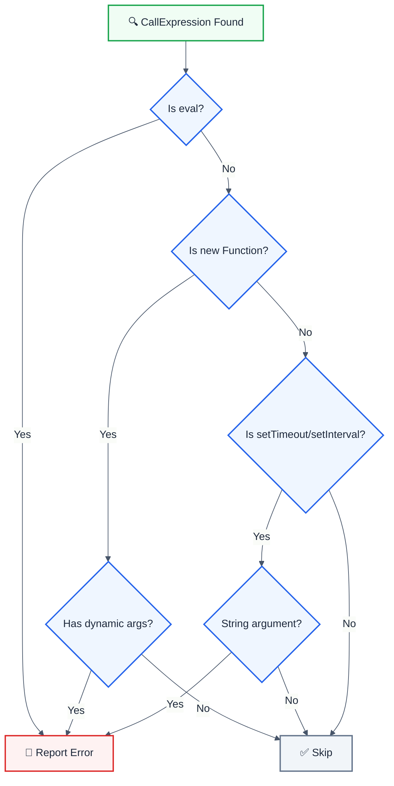

> **Keywords:** eval, code injection, CWE-94, security, dynamic code execution, Function constructor

<!-- @rule-summary -->

Detects dangerous eval() and similar code execution patterns
<!-- @/rule-summary -->

**CWE:** [CWE-95](https://cwe.mitre.org/data/definitions/95.html)  
**OWASP Mobile:** [OWASP Mobile Top 10](https://owasp.org/www-project-mobile-top-10/)

Detects dangerous eval() and similar code execution patterns. This rule is part of [`eslint-plugin-browser-security`](https://www.npmjs.com/package/eslint-plugin-browser-security).

⚠️ This rule **_errors_** by default in the `recommended` config.

## Quick Summary

| Aspect            | Details                      |
| ----------------- | ---------------------------- |
| **CWE Reference** | CWE-94 (Code Injection)      |
| **Severity**      | 🔴 Critical                  |
| **Auto-Fix**      | ❌ No (requires refactoring) |
| **Category**      | Security                     |
| **Best For**      | All JavaScript applications  |

## Vulnerability and Risk

**Vulnerability:** `eval()` and similar functions execute arbitrary code, allowing attackers to run malicious scripts if they can control the input.

**Risk:** Code injection can lead to:

- Complete application compromise
- Data theft
- Remote code execution
- Cryptocurrency mining

## Dangerous Patterns



## Examples

### ❌ Incorrect

```javascript
// Direct eval - CRITICAL
eval(userInput)
eval('console.log("' + userData + '")')

// Function constructor - CRITICAL
const fn = new Function(userCode)
const fn = new Function('a', 'b', userExpression)

// setTimeout/setInterval with strings - VULNERABLE
setTimeout('doSomething(' + userId + ')', 1000)
setInterval(userAction, 500)
```

### ✅ Correct

```javascript
// Use JSON.parse for data
const data = JSON.parse(jsonString)

// Use proper function references
setTimeout(() => doSomething(userId), 1000)
setInterval(processQueue, 500)

// Use a safe expression parser for calculators
import { Parser } from 'expr-eval'
const parser = new Parser()
const result = parser.evaluate(expression)
```

## If you also use eslint-plugin-node-security

Set `deferDynamicPayloads: true`.

```js
'browser-security/no-eval': ['error', { deferDynamicPayloads: true }]
```

`node-security/detect-eval-with-expression` covers dynamic `eval()` payloads and
classifies them (json / math / template / object), which is more than this rule
can say. Without the option **both rules report the same line** — measured: two
findings for `eval(userInput)` and for `new Function(body)()`.

The default is `false`, so this rule covers `eval()` on its own. That is
deliberate: eslint-plugin-browser-security does not depend on
eslint-plugin-node-security, and until 2026-08-16 the deferral was
unconditional — which left anyone installing this plugin alone with **no eval
coverage at all**, while `eval("2 + 2")` still reported at CVSS 9.8.

Between the two failure modes, a duplicate finding is visible and one config
line away; a silent hole in code-injection coverage is neither.

## Options

| Option                     | Type      | Default | Description                                                                                                                                                                                                             |
| -------------------------- | --------- | ------- | ----------------------------------------------------------------------------------------------------------------------------------------------------------------------------------------------------------------------- |
| `allowInTests`             | `boolean` | `false` | Skip this rule in `*.test.*` / `*.spec.*` files                                                                                                                                                                         |
| `allowFunctionConstructor` | `boolean` | `false` | Allow `new Function(...)` while still reporting `eval()`                                                                                                                                                                |
| `deferDynamicPayloads`     | `boolean` | `false` | Let node-security/detect-eval-with-expression own dynamic eval() payloads. Enable when both plugins are installed, to avoid one line being reported twice. Off by default so browser-security covers eval() on its own. |

```json
{
  "rules": {
    "browser-security/no-eval": "error"
  }
}
```

## Common Use Cases and Alternatives

| Use Case           | Instead of eval       | Use This                      |
| ------------------ | --------------------- | ----------------------------- |
| JSON parsing       | `eval(jsonStr)`       | `JSON.parse(jsonStr)`         |
| Math expressions   | `eval(expr)`          | `expr-eval` or `mathjs`       |
| Dynamic property   | `eval('obj.' + prop)` | `obj[prop]`                   |
| Template rendering | `eval(template)`      | Template literals, Handlebars |
| Config objects     | `eval(configStr)`     | `JSON.parse()` or YAML parser |

## Related Rules

- [`no-innerhtml`](./no-innerhtml.md) - XSS via innerHTML

## Known False Negatives

The following patterns are **not detected** due to static analysis limitations:

### Aliased eval

**Why**: eval assigned to a variable is not traced.

```typescript
// ❌ NOT DETECTED - Aliased eval
const execute = eval
execute(userInput)
```

**Mitigation**: Never alias eval. Use strict mode.

### Indirect eval via window

**Why**: Window property access may not be detected.

```typescript
// ❌ NOT DETECTED - Indirect via window
window['eval'](userInput)
```

**Mitigation**: Avoid dynamic eval invocation.

### Dynamic import()

**Why**: Dynamic import with user input is different but still dangerous.

```typescript
// ❌ NOT DETECTED - Dynamic import
import(userControlledPath)
```

**Mitigation**: Validate import paths. Use allowlist.

### Web Workers

**Why**: eval in Worker context may not be recognized.

```typescript
// ❌ NOT DETECTED - Worker eval
new Worker(`data:,${userCode}`)
```

**Mitigation**: Review Worker creation patterns.

## Resources

- [CWE-94: Code Injection](https://cwe.mitre.org/data/definitions/94.html)
- [MDN: eval()](https://developer.mozilla.org/en-US/docs/Web/JavaScript/Reference/Global_Objects/eval#never_use_eval!)
- [OWASP Code Injection](https://owasp.org/www-community/attacks/Code_Injection)

## Error Message Format

The rule provides **LLM-optimized error messages** (Compact 2-line format) with actionable security guidance:

```text
🔒 CWE-94 OWASP:A05 CVSS:9.8 | Code Injection detected | CRITICAL [SOC2,PCI-DSS,ISO27001]
   Fix: Review and apply the recommended fix | https://owasp.org/Top10/A05_2021/
```

### Message Components

| Component                 | Purpose                | Example                                                                                                                                                                                                                                                     |
| :------------------------ | :--------------------- | :---------------------------------------------------------------------------------------------------------------------------------------------------------------------------------------------------------------------------------------------------------- |
| **Risk Standards**        | Security benchmarks    | [CWE-94](https://cwe.mitre.org/data/definitions/94.html) [OWASP:A05](https://owasp.org/Top10/A05_2021-Injection/) [CVSS:9.8](https://nvd.nist.gov/vuln-metrics/cvss/v3-calculator?vector=AV%3AN%2FAC%3AL%2FPR%3AN%2FUI%3AN%2FS%3AU%2FC%3AH%2FI%3AH%2FA%3AH) |
| **Issue Description**     | Specific vulnerability | `Code Injection detected`                                                                                                                                                                                                                                   |
| **Severity & Compliance** | Impact assessment      | `CRITICAL [SOC2,PCI-DSS,ISO27001]`                                                                                                                                                                                                                          |
| **Fix Instruction**       | Actionable remediation | `Follow the remediation steps below`                                                                                                                                                                                                                        |
| **Technical Truth**       | Official reference     | [OWASP Top 10](https://owasp.org/Top10/A05_2021-Injection/)                                                                                                                                                                                                 |
