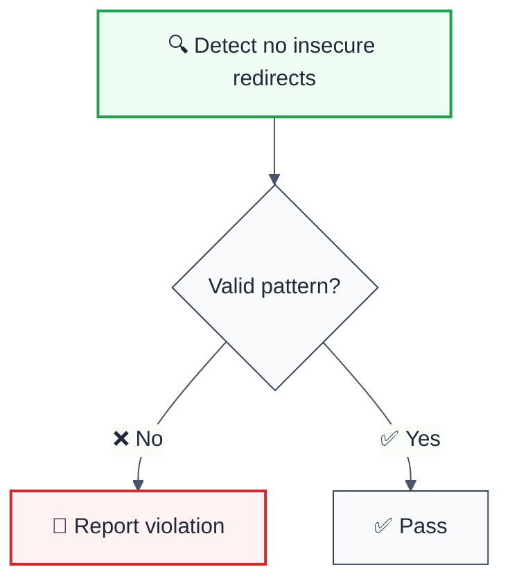

> **Keywords:** no insecure redirects, security, ESLint rule, JavaScript, TypeScript, CWE-601

<!-- @rule-summary -->

ESLint Rule: no-insecure-redirects
<!-- @/rule-summary -->

**CWE:** [CWE-693](https://cwe.mitre.org/data/definitions/693.html)  
**OWASP Mobile:** [OWASP Mobile Top 10](https://owasp.org/www-project-mobile-top-10/)

ESLint Rule: no-insecure-redirects. This rule is part of [`eslint-plugin-browser-security`](https://www.npmjs.com/package/eslint-plugin-browser-security).

## Quick Summary

| Aspect            | Details                                                                    |
| ----------------- | -------------------------------------------------------------------------- |
| **CWE Reference** | [CWE-601](https://cwe.mitre.org/data/definitions/601.html) (Open Redirect) |
| **Severity**      | Medium (security vulnerability)                                            |
| **Auto-Fix**      | ❌ No                                                                      |
| **Category**      | Security                                                                   |
| **ESLint MCP**    | ✅ Optimized for ESLint MCP integration                                    |
| **Best For**      | Web applications with redirection logic                                    |

## Vulnerability and Risk

**Vulnerability:** Insecure redirects (also known as Open Redirects) occur when an application redirects the user to a URL specified by untrusted user input without validation.

**Risk:** Attackers can redirect users to phishing sites (to steal credentials) or malicious sites (to download malware), leveraging the trust the user has in the original domain.

## Rule Details



### Why This Matters

| Issue                        | Impact           | Solution            |
| ---------------------------- | ---------------- | ------------------- |
| 🔒 **Security/Code Quality** | [Specific issue] | [Solution approach] |
| 🐛 **Maintainability**       | [Impact]         | [Fix]               |
| ⚡ **Performance**           | [Impact]         | [Optimization]      |

## Configuration

**No configuration options available.**

## Examples

### ❌ Incorrect

```typescript
// Example of incorrect usage
```

### ✅ Correct

```typescript
// Example of correct usage
```

## Configuration Examples

### Basic Usage

```javascript
// eslint.config.mjs
export default [
  {
    rules: {
      'browser-security/no-insecure-redirects': 'error',
    },
  },
]
```

## LLM-Optimized Output

```
🚨 no insecure redirects | Description | MEDIUM
   Fix: Suggestion | Reference
```

## Related Rules

- [`rule-name`](./rule-name.md) - Description

## Known False Negatives

The following patterns are **not detected** due to static analysis limitations:

### Values from Variables

**Why**: Values stored in variables are not traced.

```typescript
// ❌ NOT DETECTED - Value from variable
const value = userInput
dangerousOperation(value)
```

**Mitigation**: Validate all user inputs.

### Wrapper Functions

**Why**: Custom wrappers not recognized.

```typescript
// ❌ NOT DETECTED - Wrapper
myWrapper(userInput) // Uses dangerous API internally
```

**Mitigation**: Apply rule to wrapper implementations.

### Dynamic Invocation

**Why**: Dynamic calls not analyzed.

```typescript
// ❌ NOT DETECTED - Dynamic
obj[method](userInput)
```

**Mitigation**: Avoid dynamic method invocation.

## Further Reading

- **[OWASP Unvalidated Redirects Cheat Sheet](https://cheatsheetseries.owasp.org/cheatsheets/Unvalidated_Redirects_and_Forwards_Cheat_Sheet.html)** - Protection guide
- **[CWE-601: URL Redirection to Untrusted Site](https://cwe.mitre.org/data/definitions/601.html)** - Official CWE entry

## ⚙️ Options

| Option           | Type       | Default | Description                                     |
| ---------------- | ---------- | ------- | ----------------------------------------------- |
| `ignoreInTests`  | `boolean`  | `true`  | Skip this rule in `*.test.*` / `*.spec.*` files |
| `allowedDomains` | `string[]` | `[]`    | Redirect target domains treated as safe         |
